## Performance Benchmarks

> Machine: `` — Linux 6.1.0-43-amd64  
> Python `3.11.2` — 2026-03-16

### Full pipeline: HTML to PDF

| Document | FerroPDF | WeasyPrint | wkhtmltopdf | Speedup vs WeasyPrint |
|---|---|---|---|---|
| **Simple HTML** | 332 µs +/-65 µs | 24.6 ms +/-7.1 ms | 493.8 ms +/-75.9 ms | **74.0x faster** |
| **Styled HTML** | 364 µs +/-15 µs | 29.6 ms +/-2.3 ms | 479.5 ms +/-35.6 ms | **81.4x faster** |
| **Table  10 rows** | 1.4 ms +/-180 µs | 119.3 ms +/-13.0 ms | 546.3 ms +/-95.7 ms | **82.6x faster** |
| **Table  50 rows** | 5.8 ms +/-443 µs | 387.0 ms +/-45.5 ms | 527.7 ms +/-63.4 ms | **67.1x faster** |
| **Table 100 rows** | 10.6 ms +/-510 µs | 739.2 ms +/-26.1 ms | 509.8 ms +/-49.3 ms | **69.9x faster** |

### Visual comparison (mean render time in ms — lower is better)

```mermaid
xychart-beta
    title "HTML → PDF render time (ms) — lower is better"
    x-axis ["Simple HTML", "Styled HTML", "Table 10 rows", "Table 50 rows", "Table 100 rows"]
    y-axis "Time (ms)"
    bar [0.332, 0.364, 1.444, 5.764, 10.575]
    bar [24.584, 29.622, 119.326, 387.009, 739.248]
    bar [493.848, 479.540, 546.278, 527.738, 509.814]
```

> **Series order (left → right per group):** FerroPDF · WeasyPrint · wkhtmltopdf

> 1 warm-up run + N timed iterations. Mean +/- stdev shown.
> Reproduce: `python benchmarks/benchmark_comparison.py`