## Performance Benchmarks

> Machine: `` — Linux 6.1.0-43-amd64  
> Python `3.11.2` — 2026-03-16

### Full pipeline: HTML to PDF

| Document | FerroPDF | WeasyPrint | wkhtmltopdf | Speedup vs WeasyPrint |
|---|---|---|---|---|
| **Simple HTML** | 258 µs +/-10 µs | N/A | 533.5 ms +/-72.9 ms | — |
| **Styled HTML** | 406 µs +/-15 µs | N/A | 524.9 ms +/-49.1 ms | — |
| **Table  10 rows** | 1.7 ms +/-81 µs | N/A | 522.1 ms +/-48.7 ms | — |
| **Table  50 rows** | 4.6 ms +/-257 µs | N/A | 517.3 ms +/-45.6 ms | — |
| **Table 100 rows** | 10.6 ms +/-815 µs | N/A | 531.6 ms +/-66.2 ms | — |

### Visual comparison (mean render time in ms — lower is better)

```mermaid
xychart-beta
    title "HTML → PDF render time (ms) — lower is better"
    x-axis ["Simple HTML", "Styled HTML", "Table 10 rows", "Table 50 rows", "Table 100 rows"]
    y-axis "Time (ms)"
    bar [0.258, 0.406, 1.701, 4.587, 10.623]
    bar [533.507, 524.901, 522.082, 517.277, 531.601]
```

> **Series order (left → right per group):** FerroPDF · wkhtmltopdf

> 1 warm-up run + N timed iterations. Mean +/- stdev shown.
> Reproduce: `python benchmarks/benchmark_comparison.py`