## Performance Benchmarks

> Machine: `` — Linux 6.1.0-43-amd64  
> Python `3.11.2` — 2026-03-16

### Full pipeline: HTML to PDF

| Document | FerroPDF | WeasyPrint | wkhtmltopdf | Speedup vs WeasyPrint |
|---|---|---|---|---|
| **Simple HTML** | 359 µs +/-97 µs | 17.8 ms +/-1.2 ms | 479.7 ms +/-46.2 ms | **49.6x faster** |
| **Styled HTML** | 448 µs +/-79 µs | 29.8 ms +/-2.3 ms | 498.3 ms +/-37.2 ms | **66.6x faster** |
| **Table  10 rows** | 1.7 ms +/-172 µs | 115.0 ms +/-13.7 ms | 557.4 ms +/-74.7 ms | **66.1x faster** |
| **Table  50 rows** | 8.7 ms +/-1.9 ms | 384.1 ms +/-28.6 ms | 554.7 ms +/-58.6 ms | **44.3x faster** |
| **Table 100 rows** | 16.4 ms +/-3.5 ms | 902.9 ms +/-109.3 ms | 497.7 ms +/-41.3 ms | **54.9x faster** |

### Visual comparison (mean render time in ms — lower is better)

```mermaid
xychart-beta
    title "HTML → PDF render time (ms) — lower is better"
    x-axis ["Simple HTML", "Styled HTML", "Table 10 rows", "Table 50 rows", "Table 100 rows"]
    y-axis "Time (ms)"
    bar [0.359, 0.448, 1.740, 8.665, 16.446]
    bar [17.787, 29.809, 114.957, 384.113, 902.908]
    bar [479.657, 498.301, 557.396, 554.738, 497.716]
```

> **Series order (left → right per group):** FerroPDF · WeasyPrint · wkhtmltopdf

> 1 warm-up run + N timed iterations. Mean +/- stdev shown.
> Reproduce: `python benchmarks/benchmark_comparison.py`